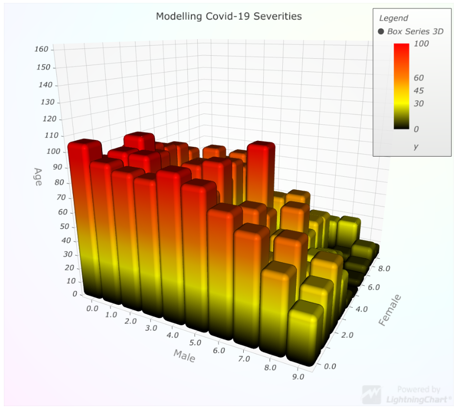

# LightningChart<sup>&#174;</sup> JS TypeScript

This repository showcases how to use the LightningChart<sup>&#174;</sup> JS charting library with TypeScript and WebPack.

---

## Getting Started

To view the 3D Graph, in 5 easy steps

1. Install Node.JS

    [npm Node.JS - Click Link to Install](https://nodejs.org/en/download/)

2. Run "npm install" in your teminal.

```yaml
    > npm install
```

3. Run "Export NODE_ ... " in your teminal.

```yaml
    > export NODE_OPTIONS=--openssl-legacy-provider
```

4. Run "npm start" in your teminal.

```yaml
    > npm start
```

5. Open browser and navigate to <http://localhost:5150>

---

## What you can do?

    a) You can move "Legend"

    b) Toggle the graph from "Legend"

    c) Move Graph around for visual effects

    d) edit the Graph with ease.

---

### FINAL

The library used here is [LightningChart JS](https://www.arction.com/lightningchart-js-interactive-examples/?theme=darkGold&page-theme=dark) that features from basic to highly specialized charts including XY, line series, heatmaps, surface charts, and this one, the [3D Box Series](https://www.arction.com/lightningchart-js-interactive-examples/examples/lcjs-example-0907-3dBoxRounded.html?theme=darkGold&page-theme=dark)


